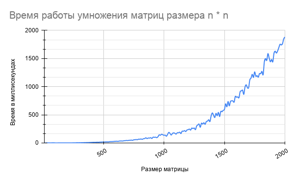
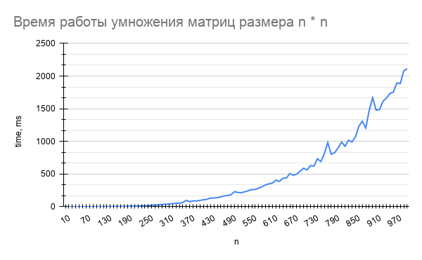
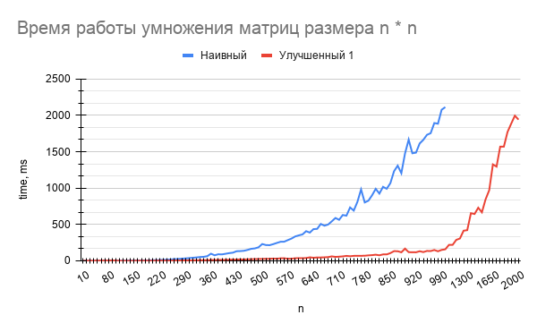
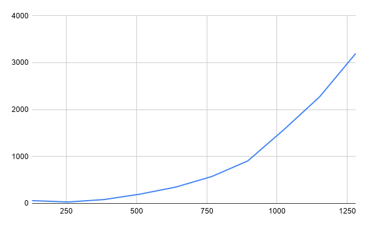

# MatrixMultiplier

Тестовое задание на заявку «Реализация методов линейной алгебры в `Multik`» для стажировки `JetBrains`

Напишите, пожалуйста, перемножение матриц на чистом `Kotlin`. Работы будут проверяться по следующим критериям (по
убыванию важности):

* Время выполнения
* Используемая память
* Читаемость   

Решения будут приниматься в виде ссылок на `GitHub`.

## Решение
Шаги, предшествующую финальному решению изложены ниже.  
График времени работы алгоритма (мс) от размера квадратных матриц `n`:



Тестовая консольная программа считывает две матрицы, умножает их, проверяет решение наивным алгоритмом и тестирует скорость умножения случайных квадратных матриц от `n = 100` до `n = 2000` с шагом `100`

**Компиляция и запуск**:

### Gradle
```
git clone https://github.com/Dalvikk/MatrixMultiplier
cd MatrixMultiplier
```

```
./gradlew.bat run --console plain
```
(просто /gradlew, если у вас *nix) или
```
./gradlew.bat build
java -jar ./MatrixMultiplier.jar
```

### Native
```
git clone https://github.com/Dalvikk/MatrixMultiplier
cd MatrixMultiplier/src/main/
kotlinc kotlin -include-runtime -d matrix.jar  
java -jar matrix.jar
```
 
> ```Считывание первой матрицы  
> Введите n:  
> 3  
> Введите m:  
> 3  
> Введите матрицу из 9 элементов:  
> 1 4 5 7 8 9 8 7 6  
> Считывание второй матрицы  
> Введите n:  
> 3  
> Введите m:  
> 10  
> Введите матрицу из 30 элементов:  
> 7 8 9 2 4 5 6 9 8 7  
> 5 9 645 4 5 0 45465 78798 1531 564165  
> 1 0 1 0 2 0 3 0 5 4  
> Time : 0 ms  
> result:  
> Matrix(n = 3, m = 10)  
> [32, 44, 2594, 18, 34, 5, 181881, 315201, 6157, 2256687]  
> [98, 128, 5232, 46, 86, 35, 363789, 630447, 12349, 4513405]  
> [97, 127, 4593, 44, 79, 40, 318321, 551658, 10811, 3949235]  
> Check via naive algorithm...  
> Random speed testing  
> n = 100, time = 6 ms  
> n = 200, time = 17 ms  
> n = 300, time = 31 ms  
> ...  
> n = 1800, time = 1144 ms  
> n = 1900, time = 1329 ms  
> n = 2000, time = 1727 ms
> ```


## Наивная реализация

Простая наивная реализация:

```kotlin
fun multiply(A: Matrix, B: Matrix): Matrix {
    val array = Array(A.n) { IntArray(B.m) { 0 } }
    for (i in 0 until A.n) {
        for (j in 0 until B.m) {
            var sum = 0
            for (k in 0 until A.m) {
                sum += A[i][k] * B[k][j]
            }
            array[i][j] = sum
        }
    }
    return Matrix(*array)
}
```

Ниже приведен график времени работы алгоритма в миллисекундах от размерности матрицы



При `n = 1000` программа работает 2.114 секунд. Неплохо, но давайте покажем что мы можем уменьшить это время в разы

> Оптимизируйте память, потом код.  
> © Очень умный человек, имя которого я забыл

## Почему мы не будем ускорять алгоритм асимптотически

Поскольку умножение матриц является операцией во многих численных алгоритмах, много работы было вложено в повышение эффективности алгоритмов умножения матриц.

Непосредственное применение математического определения умножения матриц дает алгоритм, который требует времени порядка `n^3` полевых операций для умножения двух матриц размера `n × n`.  
Лучшие асимптотические оценки времени, необходимого для умножения матриц, были известны со времен алгоритма Штрассена в 1960-х годах.  
На текущий момент алгоритм умножения матриц с наилучшей асимптотической сложностью выполняется за время `O (n^2.37)`.  
К сожалению, почти все не наивные алгоритмы являются галактическими, что значит, что из-за больших констант не могут быть реализованы на практике.  
Исключение составляет алгоритм Штрассена, который используется на практике при достаточно больших значениях `n`.  
Мы пойдем другим путем и будем ускорять программу различными методами оптимизации обращений к памяти.

## Оптимизация №1

Посмотрим на наивный алгоритм. Очевидно, мы делаем что то плохое, когда итерируемся по столбцу матрицы `B` 
Самый внутренний цикл выполняется самое большее количество раз и в нем у нас практически всегда кеш промах.  
Давайте переставим вложенные циклы следующим образом:
```kotlin
for (i in 0 until A.n) {
    for (k in 0 until A.m) {
        val first = A[i][k]
        for (j in 0 until B.m) {
            array[i][j] += first * B[k][j]
        }
    }
}
```

Теперь только в самом внешнем цикле мы итерируемся по строкам матрицы `A`, а во всех внутренних — по самой строке, то есть, по столбцам.  
Такая оптимизация ускоряет код в ~13 раз на моем ноутбучном процессоре (`Intel core i7-9750H`), и матрицы размера 1000 * 1000 перемножаются за 158 мс.



## Оптимизация №2

Популярной техникой является блокинг. В чем заключается его суть?  
Давайте вычислять перемножение матриц поблочно. Когда мы итерируемся по столбцу матрицы `B`, мы также кешируем
остальные элементы из этой же строки, но если матрица большая, когда мы к ним дойдем, они уже будут вымещены из него.  
В случае поблочного умножения, весь блок хранится в кеше.  
Часто берут размер блока в районе (размер `L1` кэша / количество байт в ячейке)^0.5.  
В нашем случае оптимальным размером блока будет 128/256  

```kotlin
val blockSize = 128
for (kk in 0 until A.n step blockSize) {
    for (jj in 0 until A.n step blockSize) {
        for (i in 0 until A.n) {
            for (j in jj until jj + blockSize) {
                var sum = array[i][j]
                for (k in kk until kk + blockSize) {
                    sum += A[i][k] * B[k][j]
                }
                array[i][j] = sum
            }
        }
    }
}
```



Это быстрее чем наивный алгоритм. Но не так быстро как предыдущий.  
Если вы почитаете статьи в интернете, вы увидите что говорят о большом бусте и хорошей производительности. 
А у нас оказалось, что не такое уж и большое ускорение. Почему так?  
Автор не эксперт, но почитав литературу сделал следующий вывод:  
Это напрямую связано с `Cache prefetching`. Если смотреть бенчмарки и графики в интернете — практически все статьи 8+ летней давности и тесты проводились на стареньких процессорах. Современные же процессоры достаточно хорошо умеют угадывать, к какому месту будет следующее обращение к кешу.  
Более того, скачок по "блокам" может запутать компилятор, и он не сможет векторизовать такой цикл. А еще, приведенный выше код работает для матриц, размер которых делится на размер блока. Если это не так (почти всегда) приходится рассматривать отдельные неприятные случаи.  
Вывод: такой подход мы забракуем

## Что дальше?

Из алгоритмов, которые работают быстрее чем за `n^3` и применяются на практике, есть только один: Алгоритм Штрассена  
* Автор планирует в ближайшем будущем реализовать его для произвольных матриц и сравнить время работы. Скорее всего, он будет обходить обычный оптимизированный алгоритм при достаточно больших `n > 2000`.  
* Автор рассматривает подход с запуском алгоритма Штрассена на больших `n`, и обычного оптимизированного на маленьких (в том числе тех, к которым сводится алгоритм)  
* Минусом такого алгоритма является большее потребление памяти и сниженная читабельность кода для случаев, когда размеры матриц не являются степенью двойки
* Конечно же, эти алгоритмы можно распараллеливать и получить теоретический выигрыш в `количество ядер` раз.

## TODO list:
* Написать [Алгоритм Штрассена](https://ru.wikipedia.org/wiki/%D0%90%D0%BB%D0%B3%D0%BE%D1%80%D0%B8%D1%82%D0%BC_%D0%A8%D1%82%D1%80%D0%B0%D1%81%D1%81%D0%B5%D0%BD%D0%B0) для произвольных матрицы и сравнить на высоких `n`
* Попробовать реализовать на `Kotlin` [похожую C++'шную](https://habr.com/ru/post/359272/) оптимизацию
